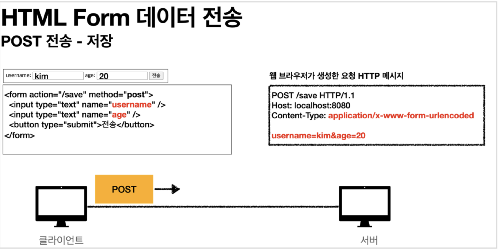

#### 최초 작성일 : 2021.07.30(금)

# Spring Boot File UPload

Spring Boot File Upload 학습

## 학습 환경

1. OS : MacOS
2. JDK : OpenJDK 11.0.5
3. Framework : Spring Boot 2.5.3
    - [Spring Initializer 링크 : https://start.spring.io](https://start.spring.io)
    - 패키징 : jar
    - 의존설정(Dependencies)
        - Spring Web
        - Thymeleaf
        - Lombok
4. Build Tools : Gradle

## 파일 업로드

1. 일반적으로 사용하는 HTML Form을 통한 파일 업로드를 이해하려면 먼저 Form을 전송하는 다음 두 가지 방식의 차이를 이해해야 한다.
    - `application/x-www-form-urlencoded`
    - `multipart/form-data`
2. `application/x-www-form-urlencoded` 방식은 HTML Form 데이터를 서버로 전송하는 가장 기본적인 방법이다.
    - Form 태그에 별도의 `enctype` 옵션이 없으면 웹 브라우저는 요청 HTTP 메시지의 헤더에 다음 내용을 추가한다.
        - `Content-Type: application/x-www-form-urlencoded`
    - 그리고 Form에 입력한 전송할 항목을 HTTP Body에 문자로 `username=kim&age=20`와 같이 `'&'`으로 구분해서 전송한다.
      
3. 파일 업로드를 하려면 파일은 문자가 아니라 `바이너리 데이터`로 전송해야 한다.
    - 문자를 전송하는 방식으로는 파일을 전송하기 어렵다.
    - 그리고 또 한가지 문제가 더 있는데, 보통 Form을 전송할 때에는 파일만 전송하는 것이 아니라는 점이다.
      ```text
      - 이름
      - 나이
      - 첨부파일
      - ...
      ```
    - 결국 문자와 바이너리를 동시에 전송해야 하는 상황이다.
3. 이 문제를 해결하기 위해 HTTP는 `multipart/form-data`라는 전송 방식을 제공한다.
    - `multipart/form-data` 방식은 다른 여러 종류의 파일과 Form의 내용을 함께 전송할 수 있다.
    - Form의 입력 결과로 생성된 HTTP 메시지를 보면 각각의 전송 항목이 구분되어 있다.
        - `Content-Disposition`이라는 항목별 헤더가 추가되어 있고, 여기에 부가 정보가 있다.
        - Form의 일반 데이터는 각 항목별로 문자가 전송되고, `파일의 경우 파일 이름과 Content-Type이 추가되고 바이너리 데이터가 전송`된다.
          

### Part

1. `multipart/form-data`는 `application/x-www-form-urlencoded`와 비교해서 매우 복잡하고 각각의 부분(`Part`)으로 나뉘어져 있다.