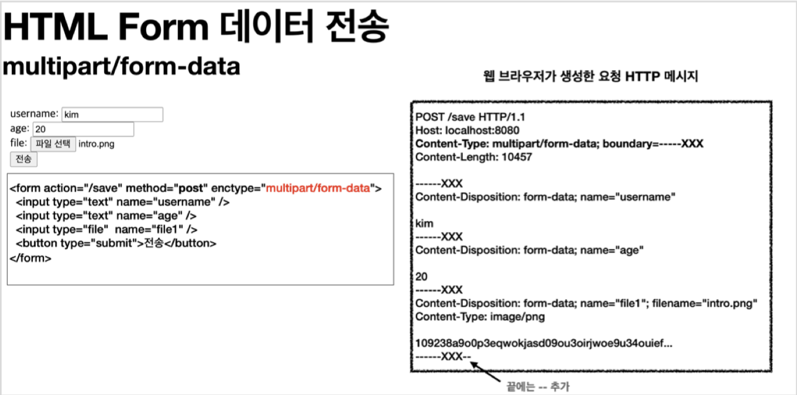

#### 최초 작성일 : 2021.07.30(금)

# Spring Boot File UPload

Spring Boot File Upload 학습

## 학습 환경

1. OS : MacOS
2. JDK : OpenJDK 11.0.5
3. Framework : Spring Boot 2.5.3
    - [Spring Initializer 링크 : https://start.spring.io](https://start.spring.io)
    - 패키징 : jar
    - 의존설정(Dependencies)
        - Spring Web
        - Thymeleaf
        - Lombok
4. Build Tools : Gradle

## 파일 업로드

1. 일반적으로 사용하는 HTML Form을 통한 파일 업로드를 이해하려면 먼저 Form을 전송하는 다음 두 가지 방식의 차이를 이해해야 한다.
    - `application/x-www-form-urlencoded`
    - `multipart/form-data`
2. `application/x-www-form-urlencoded` 방식은 HTML Form 데이터를 서버로 전송하는 가장 기본적인 방법이다.
    - Form 태그에 별도의 `enctype` 옵션이 없으면 웹 브라우저는 요청 HTTP 메시지의 헤더에 다음 내용을 추가한다.
        - `Content-Type: application/x-www-form-urlencoded`
    - 그리고 Form에 입력한 전송할 항목을 HTTP Body에 문자로 `username=kim&age=20`와 같이 `'&'`으로 구분해서 전송한다.
      
3. 파일 업로드를 하려면 파일은 문자가 아니라 `바이너리 데이터`로 전송해야 한다.
    - 문자를 전송하는 방식으로는 파일을 전송하기 어렵다.
    - 그리고 또 한가지 문제가 더 있는데, 보통 Form을 전송할 때에는 파일만 전송하는 것이 아니라는 점이다.
      ```text
      - 이름
      - 나이
      - 첨부파일
      - ...
      ```
    - 결국 문자와 바이너리를 동시에 전송해야 하는 상황이다.
3. 이 문제를 해결하기 위해 HTTP는 `multipart/form-data`라는 전송 방식을 제공한다.
    - `multipart/form-data` 방식은 다른 여러 종류의 파일과 Form의 내용을 함께 전송할 수 있다.
    - Form의 입력 결과로 생성된 HTTP 메시지를 보면 각각의 전송 항목이 구분되어 있다.
        - `Content-Disposition`이라는 항목별 헤더가 추가되어 있고, 여기에 부가 정보가 있다.
        - Form의 일반 데이터는 각 항목별로 문자가 전송되고, `파일의 경우 파일 이름과 Content-Type이 추가되고 바이너리 데이터가 전송`된다.
          

### Part

1. `multipart/form-data`는 `application/x-www-form-urlencoded`와 비교해서 매우 복잡하고 각각의 부분(`Part`)으로 나뉘어져 있다.

## Servlet 파일 업로드

```java

@Slf4j
@Controller
@RequestMapping("/servlet/v1")
public class ServletUploadControllerV1 {

    @GetMapping("/upload")
    public String newFile() {
        return "upload-form";
    }

    @PostMapping("/upload")
    public String saveFileV1(HttpServletRequest request) throws ServletException, IOException {
        log.info("request={}", request);

        String itemName = request.getParameter("itemName");
        log.info("itemName={}", itemName);

        Collection<Part> parts = request.getParts();
        log.info("parts={}", parts);

        return "upload-form";
    }
}
```

1. `request.getParts()`: multipart/form-data 전송 방식에서 각가가 나누어진 부분을 확인할 수 있다.

### 스프링 부트 multipart/form-data 사용 옵션

1. 업로드 사이즈 제한
    - 용량이 큰 파일을 무제한적으로 업로드하게 둘 수는 없으므로 업로드 사이즈를 제한할 수 있다.
    - 만약, 업로드 제한 사이즈를 넘으면 `SizeLimitExceededException` 예외가 발생한다.
   ```properties
   #파일 하나의 최대 사이즈(기본 1MB)
   spring.servlet.multipart.max-file-size=1MB
   #멀티파트 요청 하나에 여러 파일을 업로드 할 수 있는데, 그 전체 합이다.(기본 10MB)
   spring.servlet.multipart.max-request-size=10MB
   ```
2. 멀티파트 관련 처리를 하지 않을 때 프로퍼티 설정
    - 멀티파트로 전송된 데이터를 `request.getParameter("paramName")`, `request.getParts()`로 출력해 보면 값이 비어있는 것을 확인할 수 있다.
    - 설정을 바꾸고 로그를 확인해보면 `HttpServletRequest` 객체가 `StandardMultipartHttpServletRequest` > `RequestFacade`로 바뀐 것을 확인해 볼 수
      있다.
   ```properties
   #서블릿 컨테이너가 멀트파트 데이터를 처리하지 못하도록 설정(기본 true)
   spring.servlet.multipart.enabled=false
   ```
3. (참고) `spring.servlet.multipart.enabled` 옵션을 켜면 스프링의 DispatcherServlet에서 `MultipartResolver`를 실행한다.
    - MultipartResolver는 멀티파트 요청인 경우 서블릿 컨테이너가 전달하는 일반적인 `HttpServletRequest`를 `MultipartHttpServletRequest`로 변환해서 반환한다.
        - MultipartHttpServletRequest는 HttpServletRequest의 자식 인터페이스이고, 멀티파티와 관련된 추가 기능을 제공한다.
    - 스프링이 제공하는 기본 MultipartResolver는 MultipartHttpServletRequest 인터페이스를 구현한 `StandardMultipartHttpServletRequest`를
      반환한다.
        - 컨트롤러에서 HttpServletRequest 대신에 MultipartHttpServletRequest를 주입받을 수 있는데, 이것을 사용하면 멀티파트에 관련된 여러가지 처리를 편리하게 할 수
          있다.
        - 하지만 스프링에서는 `MultipartFile`이라는 것을 사용하는 것이 더 편하기 때문에 MultipartHttpServletRequest는 잘 사용하지 않는다.

### 파일 업로드 설정

1. 파일을 업로드 하려면 실제 파일이 저장되는 경로를 `application.properties`에 설정해야 한다.
    - 마지막에 `/(슬래시)`가 포함되어 있는 것에 주의하자.
    - 운영체제애 따라 설정하는 방식이 다르니, 찾아보고 설정하자.
   ```properties
   file.dir=파일 업로드 경로 설정(예. /Users/yoman/study/file/)
   ```